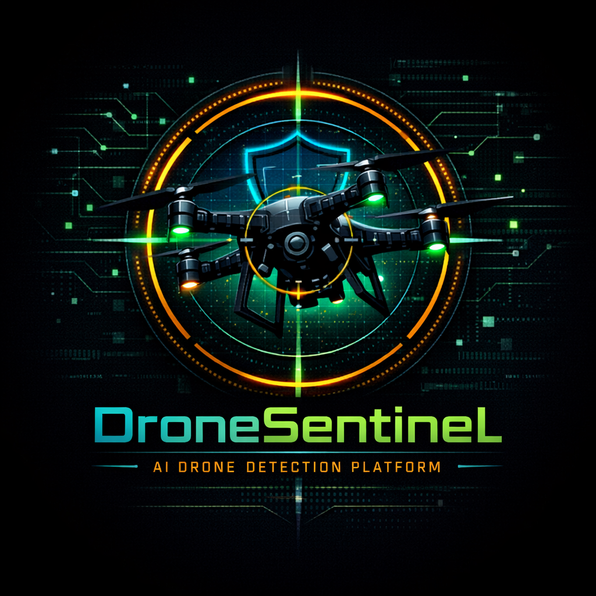
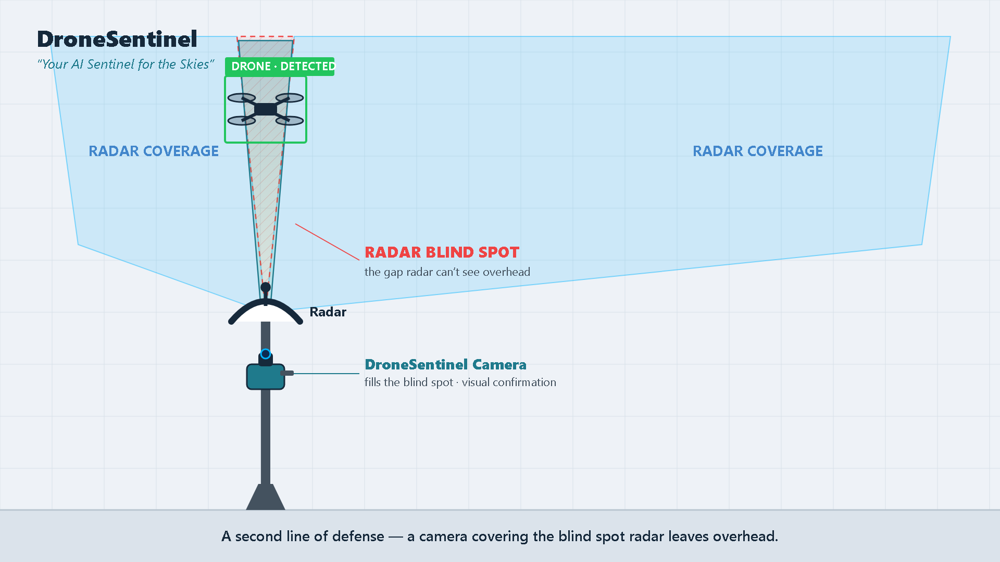
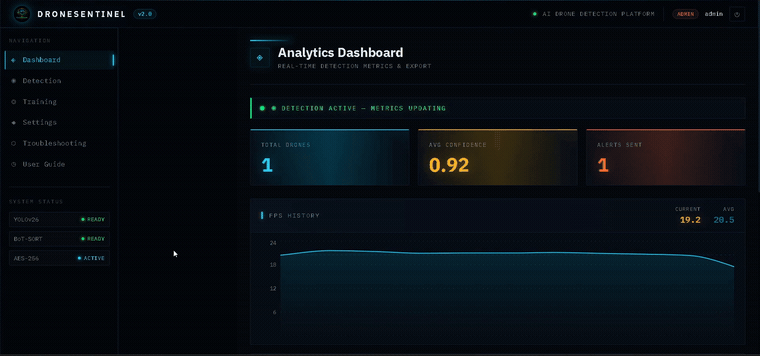
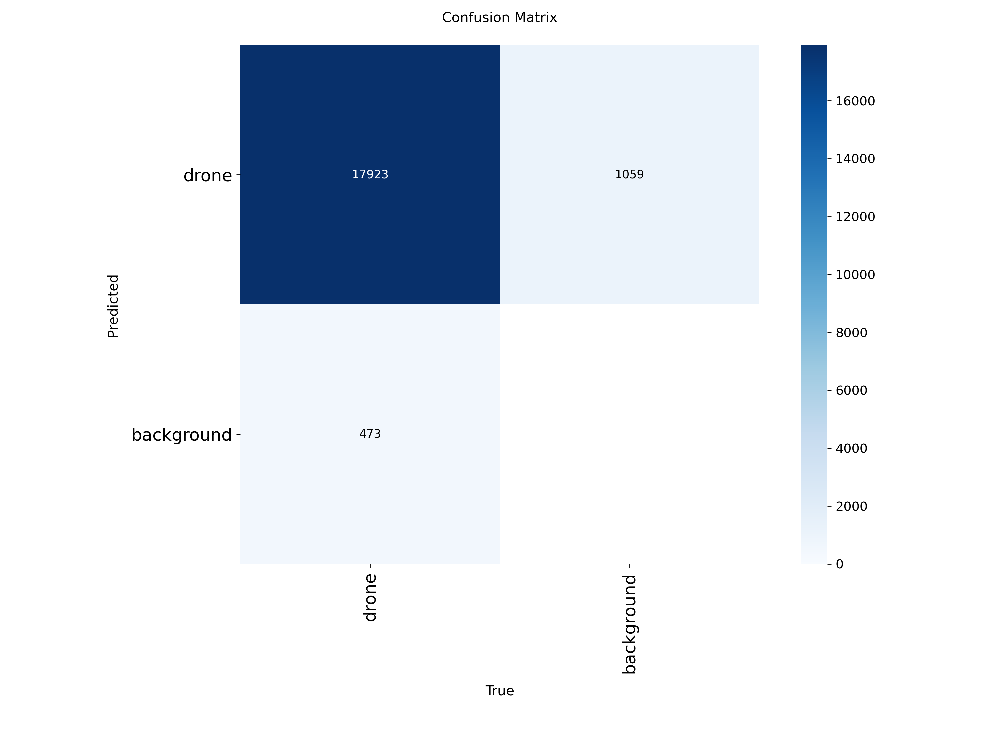
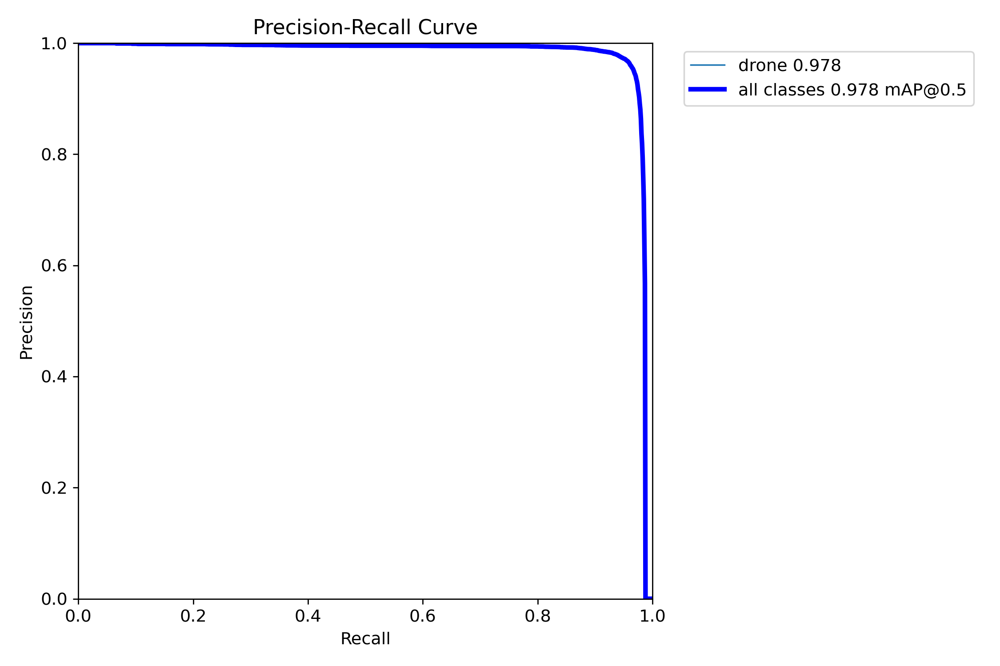
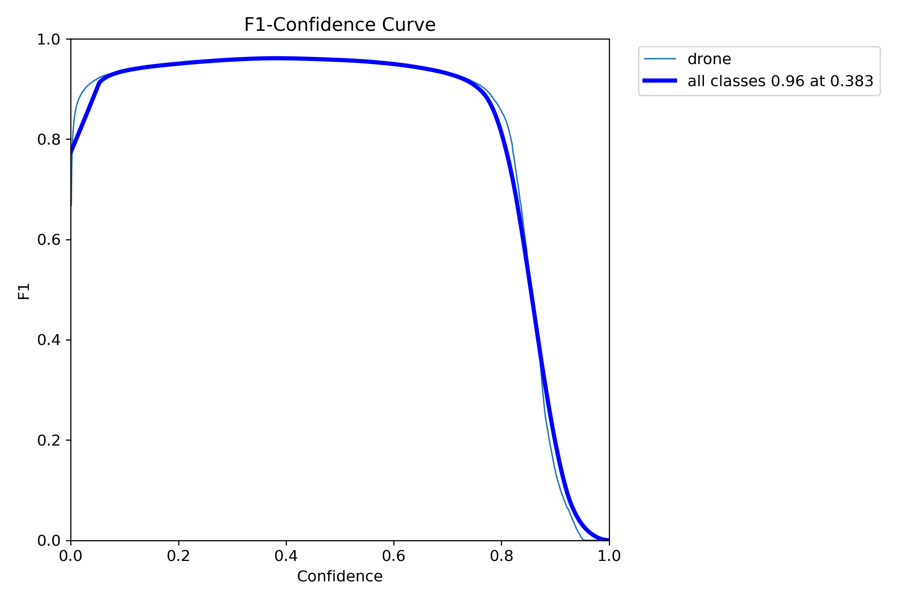
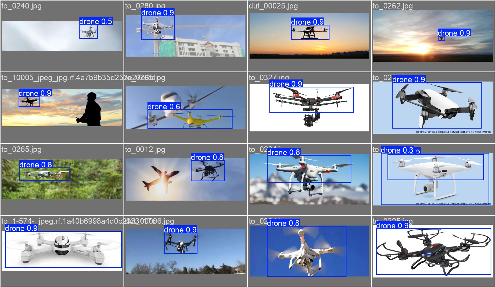

<h1 align="center">DroneSentinel :satellite:</h1>

<p align="center">
  
</p>

<p align="center">
  <em>"Your AI Sentinel for the Skies"</em><br/>
  <strong>Real-Time UAV Detection &amp; Tracking System</strong>
</p>

<p align="center">
  
  
  
  
  
  
</p>

- **DroneSentinel** is an AI-based drone detection & monitoring system that spots UAVs in a live camera feed using deep learning. It acts as a **camera-based "gap-fixer" and second line of defense** — covering the blind spots that radar, RF, and acoustic systems leave behind — and provides a full-stack web platform for **live monitoring, tracking, alerting, and reporting.**

---

## :bulb: The Idea — Covering the Blind Spots

<p align="center">
  
</p>

Commercial UAVs pose a growing threat to airports, infrastructure, and public spaces. Traditional detection systems (radar, RF, acoustic) miss small, low-altitude drones in urban environments. DroneSentinel **complements — not replaces —** these systems by adding reliable **visual confirmation** at significantly lower cost and deployment complexity.

- :white_check_mark: Camera-based gap-fixer where radar/RF/acoustic have blind spots
- :white_check_mark: Works with off-the-shelf **USB webcams** and **RTSP IP cameras** — no specialized hardware
- :white_check_mark: Browser-based dashboard — deployable on any device
- :white_check_mark: **Detect-and-alert by design** (no active jamming/takeover — which requires special licenses)

---

## :sparkles: Key Features

- **Real-time detection** on live USB / RTSP streams, recorded video, and offline images
- **Persistent multi-object tracking** with BoT-SORT (Kalman filter + Re-ID) — maintains a stable Track ID even through occlusion
- **Live analytics dashboard** — FPS, detection counts, confidence, and alert history
- **Automated alerts** — instant email & voice alerts (cooldown-gated to avoid spam)
- **Multi-format reporting** — export sessions as **CSV, JSON, HTML, and PDF**
- **Role-Based Access Control** — Administrator, Operator, Technical
- **Security-first** — AES-256 encrypted storage, JWT authentication, encrypted audit log
- **Configurable** — ROI polygon zones, confidence presets, alert cooldown, auto-restart

---

## :movie_camera: Live Demos

**BoT-SORT Tracking — one persistent ID through occlusion**
> The tracker holds the same **Track ID #1** before, during, and after the drone disappears behind foliage.

<p align="center">
  
</p>

**Live Analytics Dashboard — updating during a detection session**

<p align="center">
  
</p>

> :arrow_forward: Full-length demo videos (role walkthroughs, live analytics, tracking proof) are attached to the [**GitHub Release**](../../releases).

---

## :bar_chart: Performance Metrics

Evaluated on the held-out validation set (**18,959 images**) — fine-tuned **YOLOv26s**:

<div align="center">

| Metric | Value | Meaning |
|:------:|:-----:|:--------|
| **mAP@50** | **97.8%** | Overall detection accuracy (50% box overlap) |
| **mAP@50–95** | **68.1%** | Strict accuracy (averaged over 50–95% overlap) |
| **Precision** | **96.9%** | Of all "drone" alerts, how many were correct (few false alarms) |
| **Recall** | **95.7%** | Of all real drones, how many were caught (few misses) |
| **Best F1** | **96.1%** @ conf 0.383 | Balance of precision & recall |
| **Speed** | **20–30 FPS** | Real-time on a single consumer GPU (RTX 4050) |
| **Parameters** | **9.46M** | Lightweight — 1 class (`drone`) |

</div>

<p align="center">
  
  
</p>

<p align="center">
  
  
  
</p>

**Confusion matrix in numbers:** out of ~18,400 real drones the model caught **17,923 (TP)**, missed only **473 (FN)**, with **1,059** false alarms (FP) — a **~5.6% false-positive rate** and a **~97.4% recall**.

---

## :floppy_disk: Dataset

The model was fine-tuned on a merged dataset of **114,396 drone images** (1 class: `drone`), combining three public UAV datasets, then split for training, validation, and testing.

<div align="center">

<table>
  <thead>
    <tr><th>Split</th><th>Images</th><th>%</th></tr>
  </thead>
  <tbody>
    <tr><td><strong>Train</strong></td><td>74,123</td><td>~65%</td></tr>
    <tr><td><strong>Validation</strong></td><td>18,959</td><td>~16%</td></tr>
    <tr><td><strong>Test</strong></td><td>21,314</td><td>~19%</td></tr>
    <tr><td><strong>Total</strong></td><td><strong>114,396</strong></td><td>100%</td></tr>
  </tbody>
</table>

</div>

**Source datasets** (obtained via Kaggle, GitHub & Roboflow):
[Anti-UAV-RGBT 300](https://github.com/ZhaoJ9014/Anti-UAV) · [DUT Anti-UAV](https://github.com/wangdongdut/DUT-Anti-UAV) · [Drone-vs-Bird](https://wosdetc2023.wordpress.com/)

**Training config:** `imgsz=960`, `batch=64`, `60 epochs`, AMP, mosaic + mixup augmentation.

<p align="center">
  
</p>

> :warning: To keep this repo lightweight, the dataset is **not** included here. Download the full merged dataset from Kaggle:

<p align="center">
  <a href="https://www.kaggle.com/datasets/mohamedmostafa10110/dronesentinel-training-v2" target="_blank">
    
  </a>
</p>

<p align="center">
  <a href="https://www.kaggle.com/datasets/mohamedmostafa10110/dronesentinel-training-v2"><strong>kaggle.com/datasets/mohamedmostafa10110/dronesentinel-training-v2</strong></a>
</p>

---

## :gear: Tech Stack

**AI / Detection**
- **YOLOv26s** — fine-tuned object detection (PyTorch); TensorRT FP16 engine available for accelerated inference
- **BoT-SORT** — multi-object tracking (Kalman filter + appearance Re-ID)
- **OpenCV** — frame capture, annotation, MJPEG encoding

**Backend**
- **FastAPI** + **Uvicorn** (ASGI) · **Pydantic** validation
- **PyCryptodome** (AES-256) · **python-jose** (JWT) · **SQLite** persistence
- **pandas** + **ReportLab** (CSV / JSON / PDF exports)

**Frontend**
- **React 18** + **Material-UI** · **Recharts** (analytics) · **Axios** (API) · **React Router**

---

## :triangular_ruler: System Architecture

DroneSentinel is a **client–server** system. React sends a request; a background GPU worker runs the live pipeline and streams the annotated result back as MJPEG.

```
                REQUEST (user clicks "Start Detection")
   ┌─────────┐   Axios POST   ┌──────────┐   spawn   ┌──────────┐
   │  React  │ ─────────────► │ FastAPI  │ ────────► │  Worker  │
   │Dashboard│                │  Routes  │           │  (GPU)   │
   └────▲────┘                └──────────┘           └────┬─────┘
        │ MJPEG live stream                               │ frames
   ┌────┴─────┐   ┌──────────┐   ┌──────────┐   ┌─────────▼────┐
   │  OpenCV  │◄──│ BoT-SORT │◄──│ YOLOv26s │◄──│ Video Source │
   │  (draw)  │   │ (track)  │   │ (detect) │   │ USB/RTSP/File│
   └──────────┘   └──────────┘   └──────────┘   └──────────────┘
                        LIVE PIPELINE (per frame)
```

**Role-Based Access Control** — every account sees only the tabs its job requires:

<div align="center">

| Role | Access | Allowed Tabs |
|:----:|:-------|:-------------|
| :large_orange_diamond: **Administrator** | Full access | Dashboard · Detection · Training · Settings · Troubleshooting · User Guide |
| :large_blue_circle: **Operator** | Live detection | Dashboard · Detection · User Guide |
| :white_circle: **Technical** | Train & diagnose | Training · Troubleshooting · User Guide |

</div>

---

## :file_folder: Directory Structure

```plaintext
DroneSentinel/
├── assets/                          # README images, demo GIFs, metric plots
├── dronesentinel/
│   ├── backend/
│   │   ├── app/
│   │   │   ├── main.py              # FastAPI entry point
│   │   │   ├── routes/              # detection, training, analytics, admin, troubleshoot
│   │   │   ├── services/            # detector (YOLOv26s), tracker (BoT-SORT), email, tts
│   │   │   ├── workers/             # detection_worker, training_worker
│   │   │   ├── auth.py              # JWT auth + users
│   │   │   ├── encryption.py        # AES-256
│   │   │   └── settings.py          # encrypted config
│   │   ├── requirements.txt
│   │   └── yolo26s.pt               # fine-tuned drone model (~20 MB)
│   └── frontend/
│       ├── src/                     # React app (App.js, api.js, pages/, theme.js)
│       ├── public/
│       ├── package.json
│       └── .env.example
├── .gitignore
├── LICENSE
└── README.md
```

---

## :computer: Installation &amp; Usage

> **Requirements:** Python **3.11+**, Node.js **18+**, and an **NVIDIA GPU with CUDA** for real-time detection (CPU works but is much slower). Both services run at the same time.

### 1. Clone the repository
```bash
git clone https://github.com/MohamedMostafa010/DroneSentinel.git
cd DroneSentinel/dronesentinel
```

### 2. Start the Backend (FastAPI · port 8000)
```bash
cd backend
python -m venv venv
venv\Scripts\activate          # Windows  (use: source venv/bin/activate on Linux/Mac)
pip install -r requirements.txt
uvicorn app.main:app --reload --port 8000
```

### 3. Start the Frontend (React · port 3000)
```bash
cd frontend
copy .env.example .env         # Windows  (use: cp .env.example .env elsewhere)
npm install
npm start                      # opens http://localhost:3000
```

### 4. First-run setup
- On first launch, you'll be prompted to **create the admin account** (username `admin`, choose a strong password — min 8 chars, upper + lower + digit + symbol).
- The encrypted `config/` (keys, settings, users) is **auto-generated** on first run — it is intentionally **not** shipped in this repo.
- Add **Operator** / **Technical** users any time from the **Admin → Users** panel.
- Pick your camera source (USB index, RTSP URL, or a video file) in the **Detection** tab and press **Start**.

---

## :busts_in_silhouette: Team &amp; Supervision

**Graduation Project — Cybersecurity Major**
College of Computing and Information Technology (CCIT), AASTMT — Smart Village, 2026

<div align="center">

**Mohamed Mostafa Sayed** &nbsp;·&nbsp; **Abdelrahman Ahmed Sayed** &nbsp;·&nbsp; **Basel Hany Abdullah**  
**Abdallah Mohamed Beshr** &nbsp;·&nbsp; **Hazem Ahmed Bakr** &nbsp;·&nbsp; **Mohamed Hany El Kordy**

</div>

**Supervisor:** Assoc. Prof. Ahmed Maher

---

## :handshake: Contributing

Pull requests are welcome! Ideas for new camera integrations, drone classes, tracking improvements, or deployment targets (edge / Docker) are appreciated.

## :book: License

This project is released under the **MIT License** — see [LICENSE](LICENSE).
