<h1 align="center">DroneSentinel :satellite:</h1>

<p align="center">
  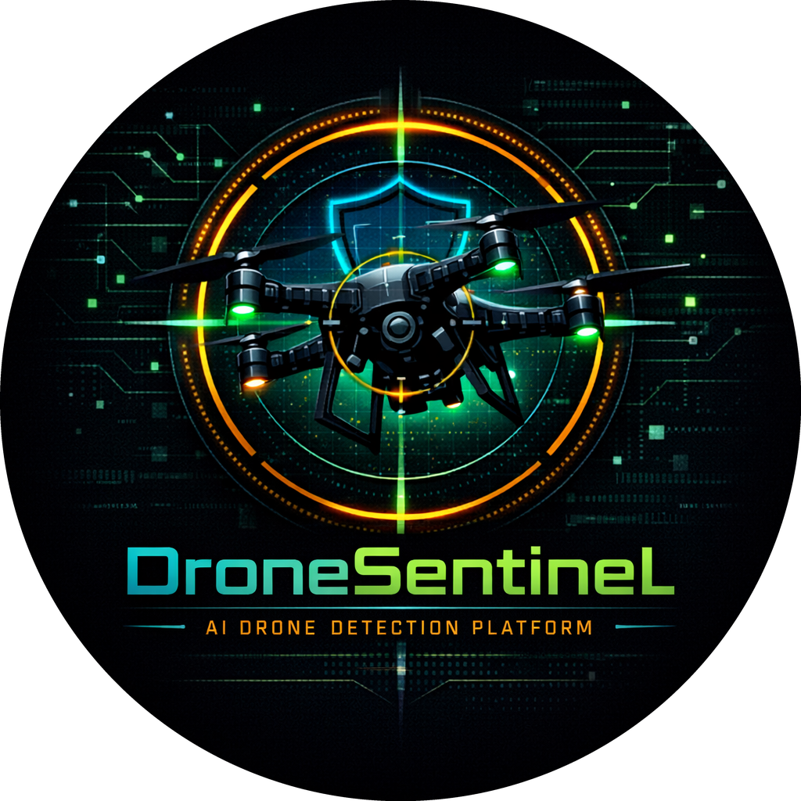
</p>

<p align="center">
  <em>"Your AI Sentinel for the Skies"</em><br/>
  <strong>Real-Time UAV Detection &amp; Tracking System</strong>
</p>

<p align="center">
  
  
  
  
  
  
</p>

- **DroneSentinel** is an AI-based drone detection & monitoring system that spots UAVs in a live camera feed using deep learning. It acts as a **camera-based "gap-fixer" and second line of defense** - covering the blind spots that radar, RF, and acoustic systems leave behind - and provides a full-stack web platform for **live monitoring, tracking, alerting, and reporting.**

---

## :bulb: The Idea - Covering the Blind Spots

Traditional detection systems (radar, RF, acoustic) have **blind spots** - especially small, low-altitude drones directly overhead or up close. DroneSentinel places affordable cameras exactly where those systems can't see, adding **visual confirmation** as a second line of defense. The two diagrams below show the concept.

<p align="center">
  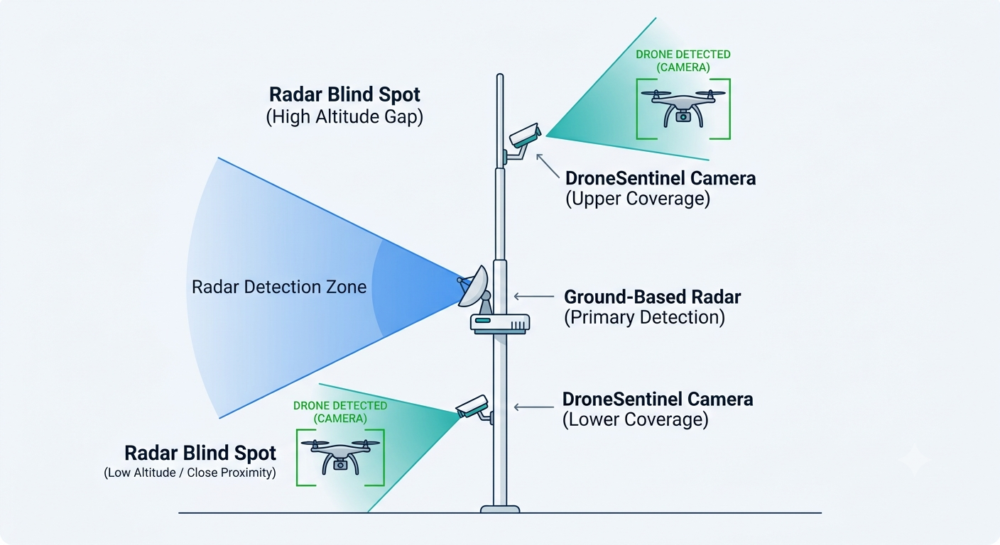
</p>
<p align="center"><sub><strong>1.</strong> Radar leaves blind spots - both high (altitude gap) and low (close proximity).</sub></p>

<p align="center">
  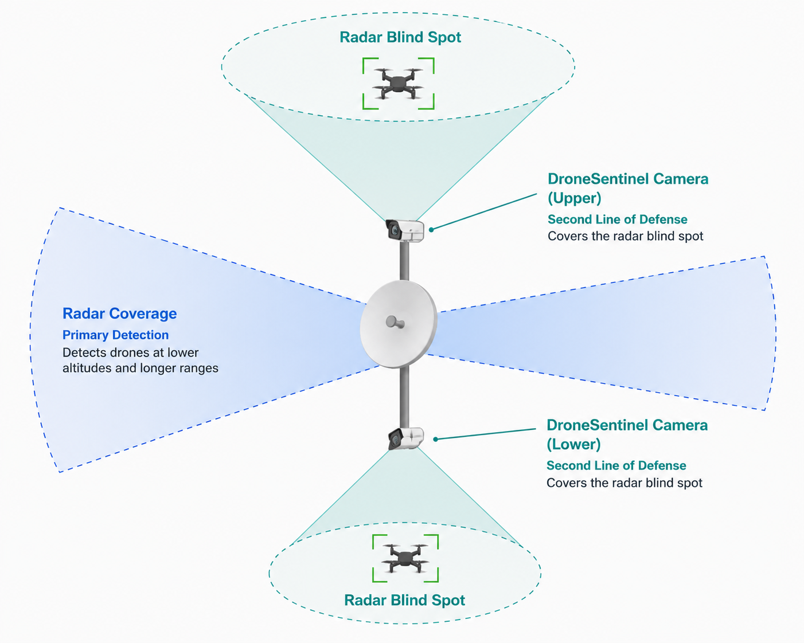
</p>
<p align="center"><sub><strong>2.</strong> Upper &amp; lower DroneSentinel cameras cover exactly those radar blind spots - a second line of defense.</sub></p>

- :white_check_mark: Camera-based gap-fixer where radar/RF/acoustic have blind spots
- :white_check_mark: Works with off-the-shelf **USB webcams** and **RTSP IP cameras** - no specialized hardware
- :white_check_mark: **Complements, not replaces** existing sensors - adds reliable visual confirmation
- :white_check_mark: **Detect-and-alert by design** (no jamming/takeover - which requires special licenses)

---

## :sparkles: Key Features

- **Real-time detection** on live USB / RTSP streams, recorded video, and offline images
- **Persistent multi-object tracking** with BoT-SORT (Kalman filter + Re-ID) - keeps a stable Track ID even through occlusion
- **Live analytics dashboard** - FPS, detection counts, confidence, and alert history
- **Automated alerts** - instant email & voice alerts (cooldown-gated) + session-summary emails
- **Multi-format reporting** - export sessions as **CSV, JSON, HTML, and PDF**
- **Role-Based Access Control** - Administrator, Operator, Technical
- **Security-first** - AES-256 encrypted storage, JWT authentication, encrypted audit log

---

## :movie_camera: Live Demos

### BoT-SORT Tracking - one persistent ID through occlusion
This is the core proof of our tracker. A drone flies at night, disappears **behind foliage (occlusion)**, then reappears - and BoT-SORT keeps assigning it the **same Track ID #1** the whole time. The clip freezes and zooms on each detection to make the ID visible. *(Full clip, untrimmed.)*

<p align="center">
  
</p>

### Live Analytics Dashboard - updating during a detection session
The analytics dashboard updating in **real time** while a live detection session runs alongside - total drones, average confidence, alerts sent, and a live FPS history chart. *(Full clip, untrimmed.)*

<p align="center">
  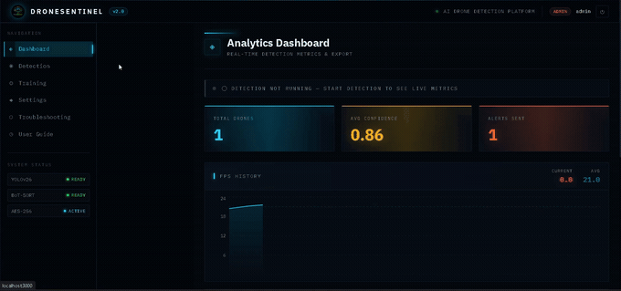
</p>

> :information_source: The clips throughout this README are **inline GIF previews** (full length, untrimmed). The original **full-quality MP4s** are attached to the [**v1.0 Release**](../../releases/tag/v1.0) for download.

---

## :desktop_computer: The Web Platform (Frontend)

A **single-page React application** - no install for the operator, just a browser. It shows the live MJPEG stream with boxes/IDs, real-time analytics, and a built-in User Guide. Access is **role-aware**: each user only sees the tabs their role permits, and unauthorized/unknown routes are handled with clean **403 / 404** pages.

<p align="center">
  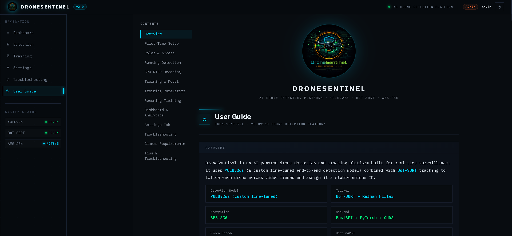
</p>
<p align="center"><sub>Built-in User Guide - roles &amp; access control, camera setup, and troubleshooting, all inside the app.</sub></p>

<p align="center">
  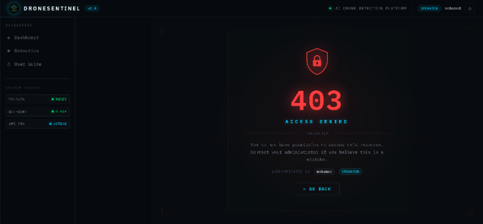
  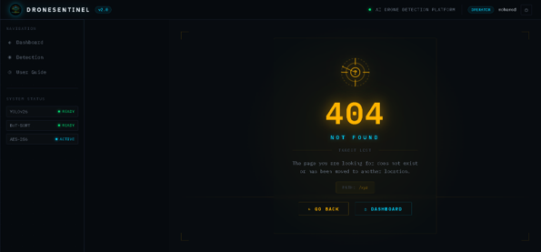
</p>
<p align="center"><sub><strong>403 - Access Denied</strong> (role opens a tab it isn't allowed) &nbsp;·&nbsp; <strong>404 - Page Not Found</strong> (unknown route).</sub></p>

---

## :camera: Hardware

DroneSentinel runs on **off-the-shelf, consumer hardware** - no specialized rig. We tested it with two cameras: a plain USB webcam for primary capture, and a Wi-Fi pan-tilt camera as an RTSP source.

<p align="center">
  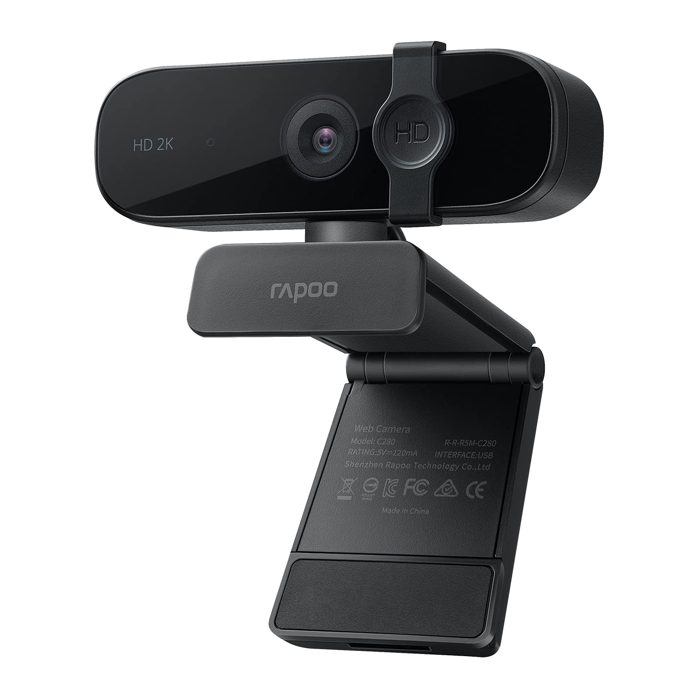
  &nbsp;&nbsp;&nbsp;&nbsp;
  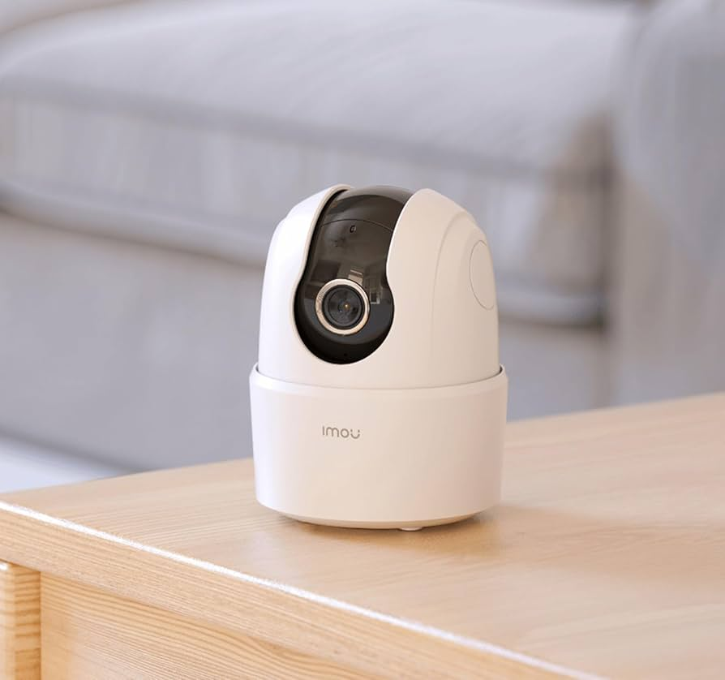
</p>
<p align="center"><sub><strong>Rapoo C280</strong> - 1080p USB webcam · primary capture &nbsp;&nbsp;|&nbsp;&nbsp; <strong>Imou Ranger 2C</strong> - 360° Pan-Tilt Wi-Fi · RTSP test camera</sub></p>

> We used the **Imou Ranger 2C** as an **RTSP source** - to test network connectivity and GPU video **encoding/decoding** across the pipeline (NVDEC/FFmpeg), proving the system works with real IP cameras, not just USB.

---

## :brain: The AI Model - YOLOv26s

A **YOLOv26s** detector, fine-tuned end-to-end specifically for drones (single class: `drone`).

- **Custom fine-tuned** - trained at **960×960**, NMS-free
- **Large, diverse dataset** - 114,396 images (tiny drones, rain & fog, night vision)
- **Trained on Colab (NVIDIA H100)** - 60 epochs, batch size 64
- **Deployed on an RTX 4050** - real-time inference on a laptop GPU

> :package: **Trained weights are included** in [`models/`](models) in four formats - PyTorch (`best.pt`), ONNX (`best.onnx`), and TensorRT FP16/FP32 engines (`best_hf.engine` / `best_nf.engine`). See [`models/README.md`](models/README.md) for which to use.

### Trained Model Weights - YOLOv26s

All four files are the **same fine-tuned DroneSentinel model** (single class: `drone`, trained at 960×960) - just exported to different formats for different runtimes. `best.pt` is the source; the rest are optimized/portable exports of it.

| File | Format | Precision | Size | Use it for |
|------|--------|:---------:|:----:|-----------|
| **`best.pt`** | PyTorch | FP32 | ~20 MB | The primary weights. This is what the app loads (shipped as `dronesentinel/backend/yolo26s.pt`). Runs anywhere PyTorch + CUDA is available. |
| **`best.onnx`** | ONNX | FP32 | ~38 MB | Framework-agnostic export - run with ONNX Runtime on CPU/GPU across platforms, or convert to other runtimes. |
| **`best_hf.engine`** | TensorRT | **FP16 (half)** | ~25 MB | Fastest inference on NVIDIA GPUs - half precision, smallest engine. |
| **`best_nf.engine`** | TensorRT | **FP32 (full)** | ~47 MB | Higher-precision TensorRT engine - full precision, larger. |

#### Notes
- **Start with `best.pt`** - it's the most portable and is what the application uses out of the box.
- **The `.engine` files are hardware- and version-specific.** A TensorRT engine is built for a particular GPU + TensorRT/CUDA version, so it may not load on a different machine. If a `.engine` fails to load, rebuild it from `best.onnx` (or `best.pt`) on your own hardware.
- Metrics for this model: **mAP@50 = 97.8%**, **mAP@50–95 = 68.1%**, **Precision = 96.9%**, **Recall = 95.7%**, **Best F1 = 96.1%**.

### Dataset

The model was fine-tuned on a merged dataset of **114,396 drone images**, combining three public UAV datasets, then split for training, validation, and testing.

<div align="center">

<table>
  <thead><tr><th>Split</th><th>Images</th><th>%</th></tr></thead>
  <tbody>
    <tr><td><strong>Train</strong></td><td>74,123</td><td>~65%</td></tr>
    <tr><td><strong>Validation</strong></td><td>18,959</td><td>~16%</td></tr>
    <tr><td><strong>Test</strong></td><td>21,314</td><td>~19%</td></tr>
    <tr><td><strong>Total</strong></td><td><strong>114,396</strong></td><td>100%</td></tr>
  </tbody>
</table>

</div>

**Composed from three public datasets** (obtained via Kaggle, GitHub & Roboflow):

<p align="center">
  
  &nbsp;&nbsp;&nbsp;&nbsp;&nbsp;&nbsp;
  
  &nbsp;&nbsp;&nbsp;&nbsp;&nbsp;&nbsp;
  
</p>

<p align="center"><sub>Source datasets: <a href="https://github.com/ZhaoJ9014/Anti-UAV">Anti-UAV-RGBT 300</a> · <a href="https://github.com/wangdongdut/DUT-Anti-UAV">DUT Anti-UAV</a> · <a href="https://wosdetc2023.wordpress.com/">Drone-vs-Bird</a></sub></p>

> :floppy_disk: The dataset is **not** shipped in this repo (too large). Download the full merged v2 dataset from Kaggle:

<p align="center">
  <a href="https://www.kaggle.com/datasets/mohamedmostafa10110/dronesentinel-training-v2" target="_blank">
    
  </a>
  <br/>
  <a href="https://www.kaggle.com/datasets/mohamedmostafa10110/dronesentinel-training-v2"><strong>kaggle.com/datasets/mohamedmostafa10110/dronesentinel-training-v2</strong></a>
</p>

### Performance Metrics

Evaluated on the held-out validation set (**18,959 images**):

<div align="center">

| Metric | Value | Meaning |
|:------:|:-----:|:--------|
| **mAP@50** | **97.8%** | Overall detection accuracy (50% box overlap) |
| **mAP@50–95** | **68.1%** | Strict accuracy (averaged over 50–95% overlap) |
| **Precision** | **96.9%** | Of all "drone" alerts, how many were correct (few false alarms) |
| **Recall** | **95.7%** | Of all real drones, how many were caught (few misses) |
| **Best F1** | **96.1%** @ conf 0.383 | Balance of precision &amp; recall |
| **Speed** | **20–30 FPS** | Real-time on a single consumer GPU (RTX 4050) |
| **Parameters** | **9.46M** | Lightweight - 1 class (`drone`) |

</div>

### Training Results

Training and validation curves over 60 epochs - losses fall steadily while precision, recall, and mAP climb and plateau near the top, with **no over-fitting gap** between train and validation.

<p align="center">
  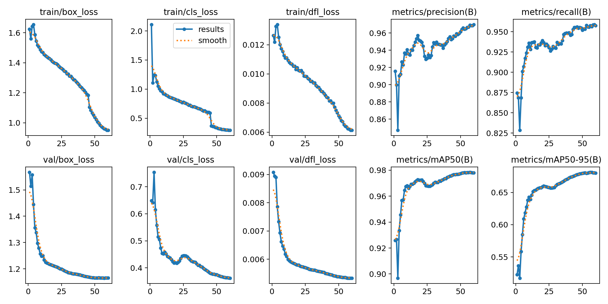
</p>

The Precision–Recall curve hugs the top-right corner (**mAP@50 = 0.978**) - the ideal shape.

<p align="center">
  
</p>

### Detection Quality - Confusion &amp; Labels

The confusion matrix shows the model caught **17,923** real drones (true positives), missed only **473** (false negatives), with **1,059** false alarms - a **~5.6% false-positive rate** and **~97.4% recall**.

<p align="center">
  
</p>

The label chart shows the dataset holds **74,507** drone instances, mostly **small and centered** in frame - the realistic, difficult case.

<p align="center">
  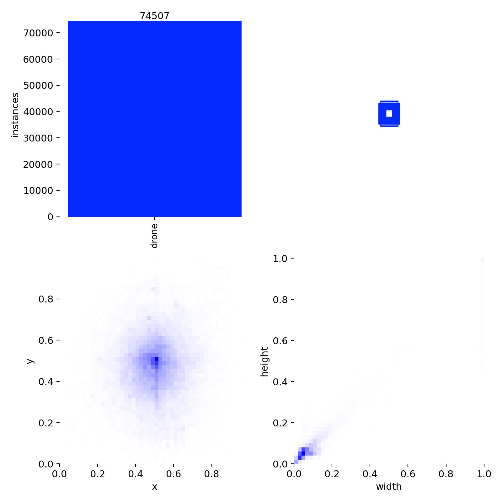
</p>

### Training Batches - Augmented Inputs

A sanity check on the data pipeline: each training batch is built from **mosaic + mixup augmentation** (multiple images stitched together, color/scale jitter), teaching the model to detect drones in cluttered, varied conditions.

<p align="center">
  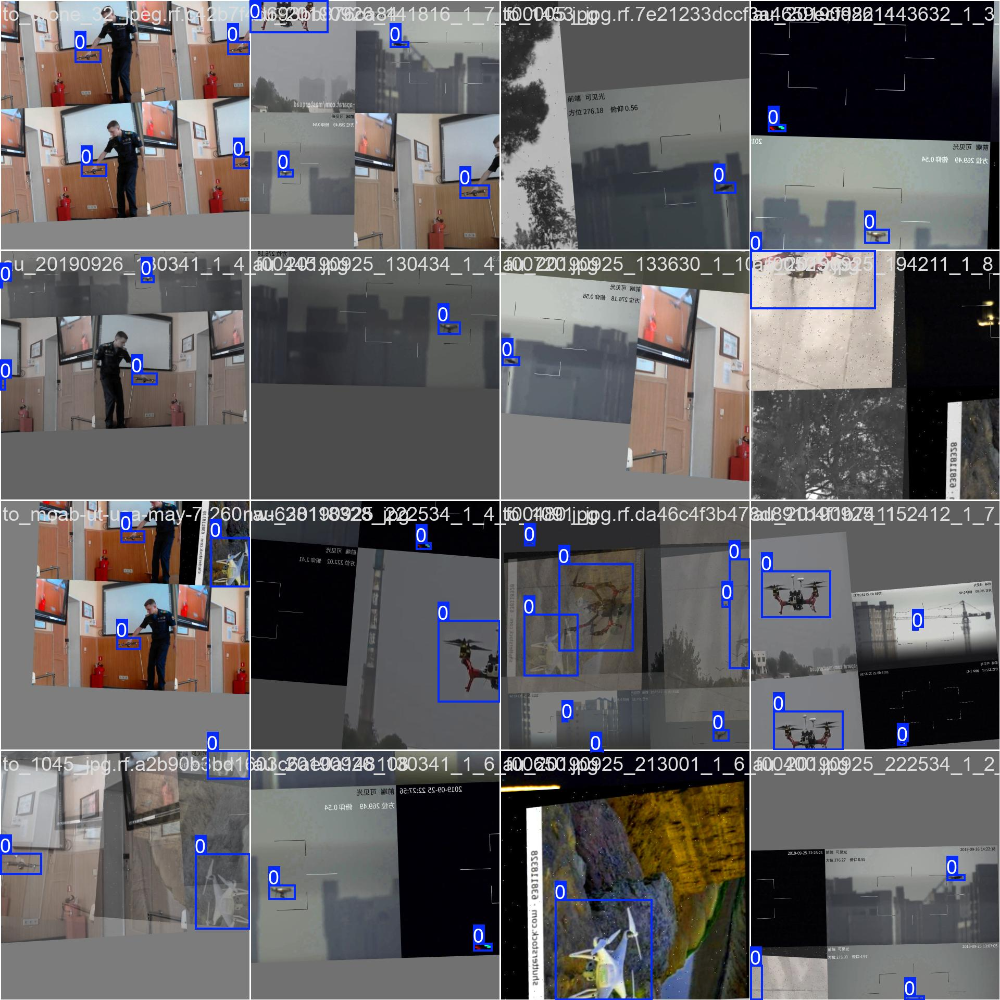
  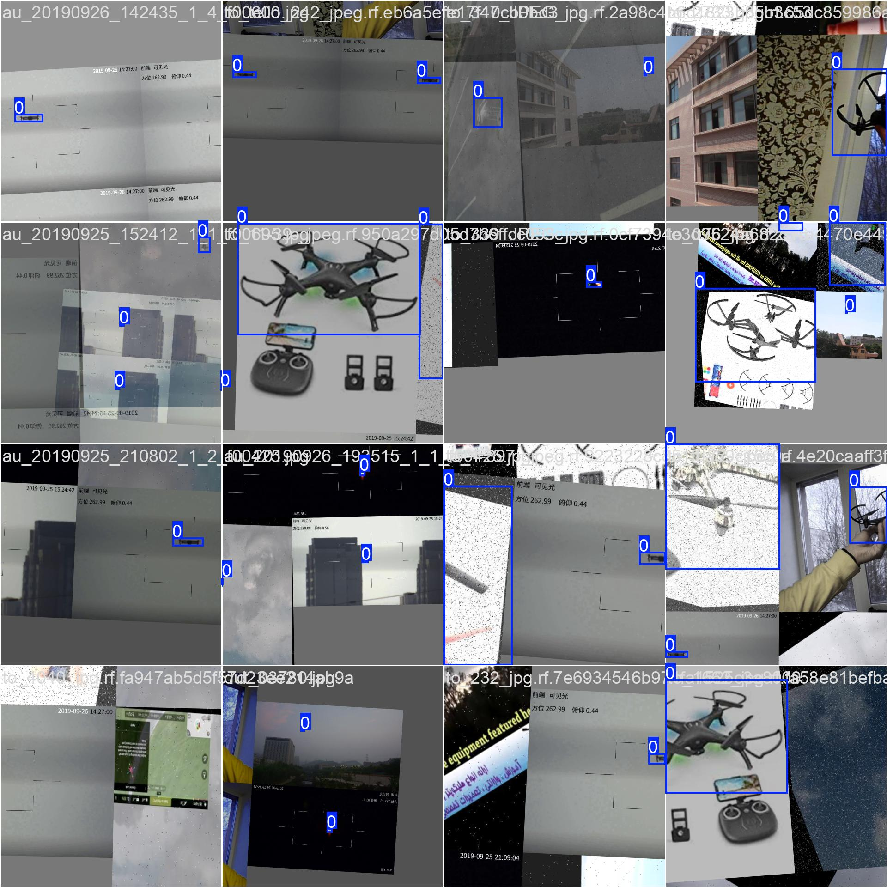
  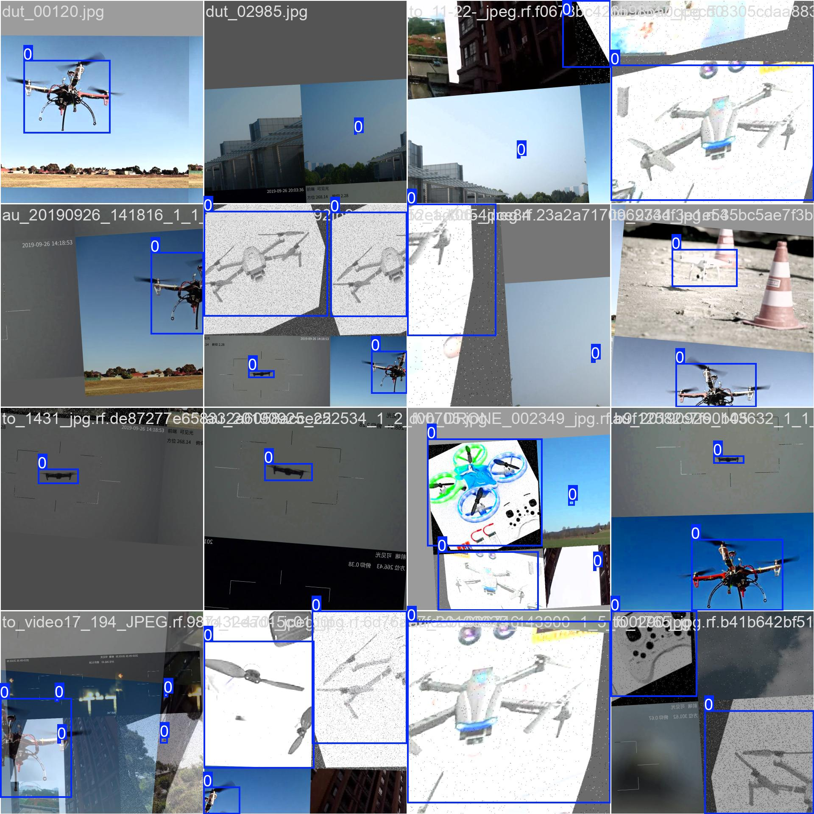
</p>

### Validation - Ground Truth vs Prediction

For each validation batch, the **left** grid shows the ground-truth labels and the **right** grid shows the **model's predictions** - they match almost perfectly, including tiny and distant drones.

<p align="center">
  
  
</p>
<p align="center">
  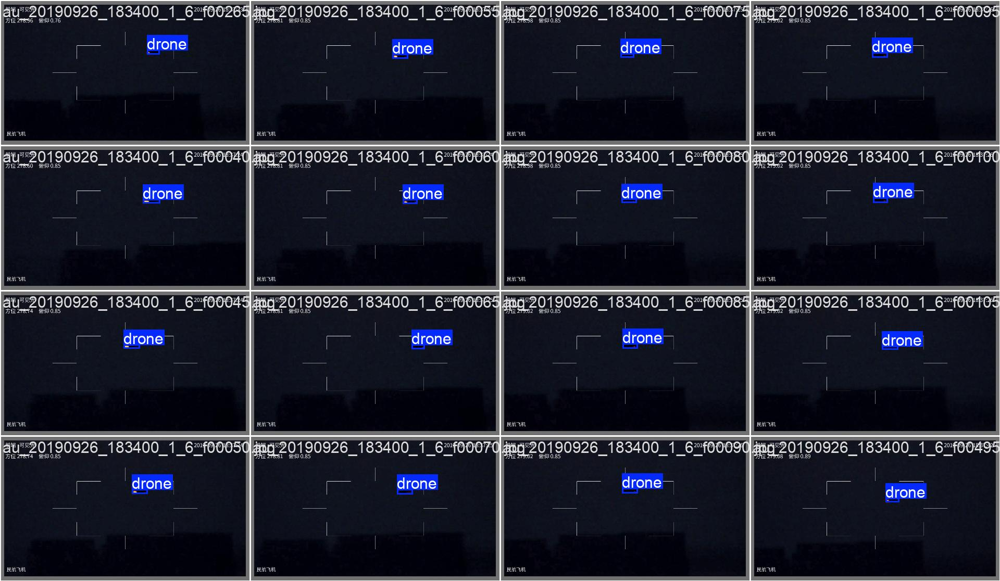
  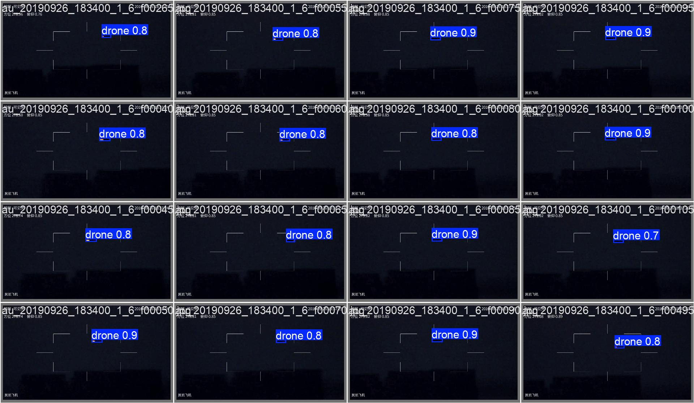
</p>
<p align="center">
  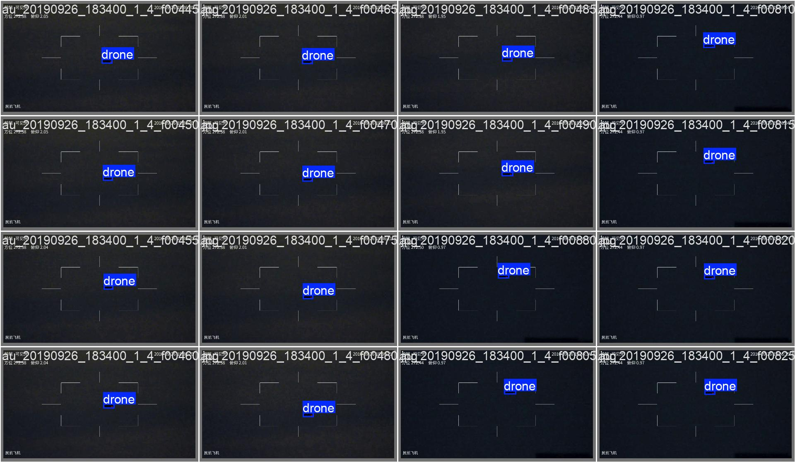
  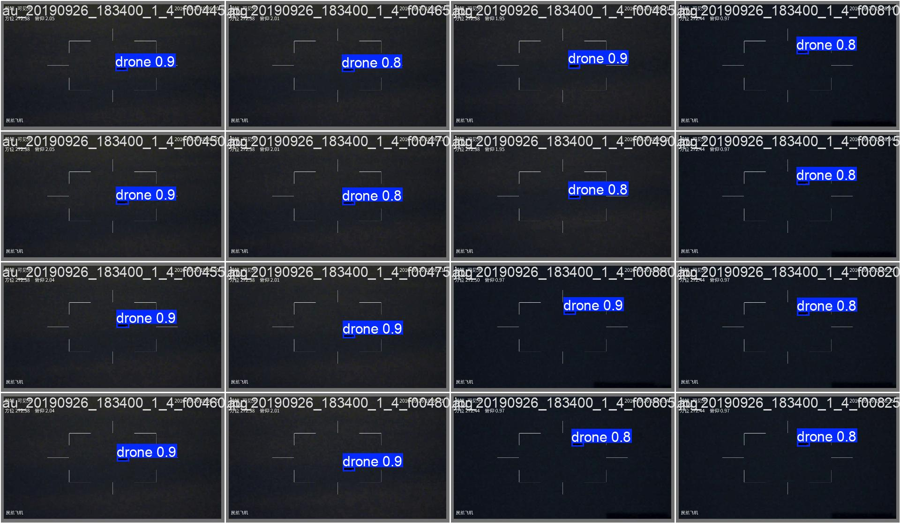
</p>
<p align="center"><sub>For every pair - <strong>left = ground-truth labels</strong>, <strong>right = model predictions</strong>.</sub></p>

---

## :bell: Alerts &amp; Reporting

When a drone is detected, DroneSentinel doesn't just draw a box - it **notifies and documents**. Alerts are cooldown-gated to avoid spam, and every session can be exported in multiple formats.

### Automated Email Alerts
An **instant email** fires the moment a drone is confirmed, and a **session-summary email** is sent when detection stops (totals, duration, alerts).

<p align="center">
  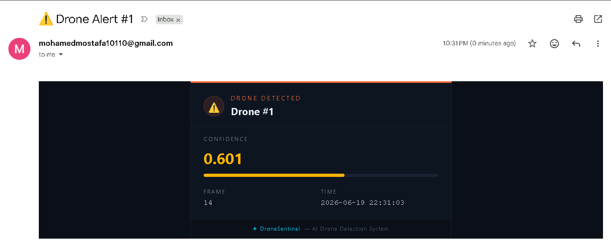
</p>
<p align="center"><sub>Instant drone-detected email alert.</sub></p>

<p align="center">
  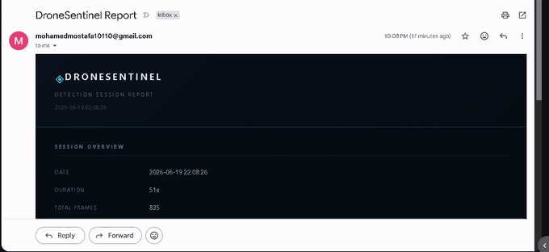
</p>
<p align="center"><sub>Session-summary email - sent automatically when a detection session ends.</sub></p>

### Multi-Format Exports
Every session exports to **CSV** and **JSON** (data/integration) and to **HTML** and **PDF** (human-readable reports).

<p align="center">
  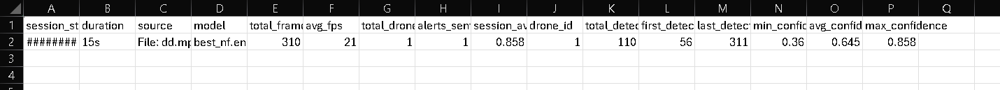
</p>
<p align="center"><sub>CSV export - session records, FPS, and per-drone data.</sub></p>

<p align="center">
  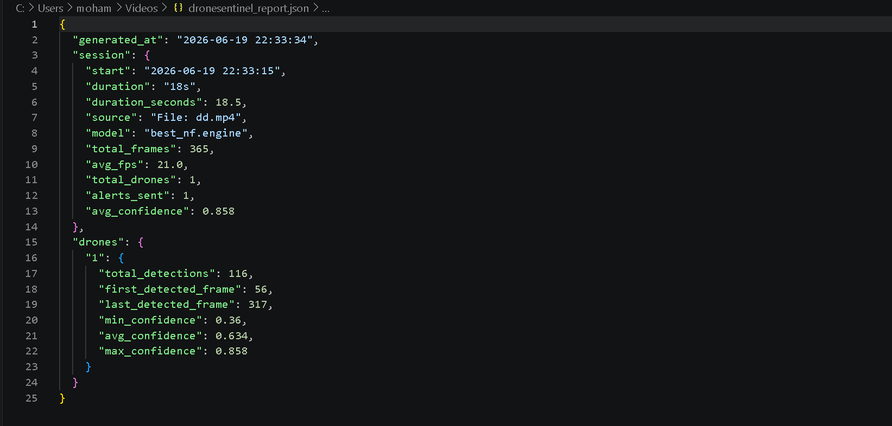
</p>
<p align="center"><sub>JSON export - the same data, structured for integration.</sub></p>

<p align="center">
  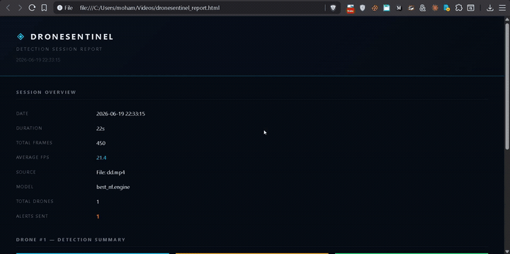
</p>
<p align="center"><sub>HTML report export.</sub></p>

<p align="center">
  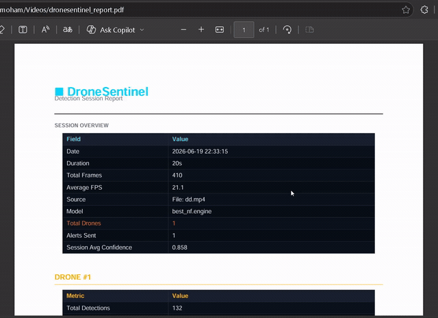
</p>
<p align="center"><sub>PDF report export.</sub></p>

### Real-World Field Tests
We validated DroneSentinel outdoors against a real drone - in **daytime** and at **night** - confirming it detects and tracks in real conditions, not just on the validation set.

<p align="center">
  
  
</p>
<p align="center"><sub><strong>Daytime - 18 meters range</strong> (left) and <strong>Nighttime - 12 meters range</strong> (right) real-world field tests.</sub></p>

---

## :triangular_ruler: System Architecture

DroneSentinel is a **client–server** system. React sends a request; a background GPU worker runs the live pipeline and streams the annotated result back as MJPEG.

```
                REQUEST (user clicks "Start Detection")
   ┌─────────┐   Axios POST   ┌──────────┐   spawn   ┌──────────┐
   │  React  │ ─────────────► │ FastAPI  │ ────────► │  Worker  │
   │Dashboard│                │  Routes  │           │  (GPU)   │
   └────▲────┘                └──────────┘           └────┬─────┘
        │ MJPEG live stream                               │ frames
   ┌────┴─────┐   ┌──────────┐   ┌──────────┐   ┌─────────▼────┐
   │  OpenCV  │◄──│ BoT-SORT │◄──│ YOLOv26s │◄──│ Video Source │
   │  (draw)  │   │ (track)  │   │ (detect) │   │ USB/RTSP/File│
   └──────────┘   └──────────┘   └──────────┘   └──────────────┘
                        LIVE PIPELINE (per frame)
```

**Role-Based Access Control** - every account sees only the tabs its job requires:

<div align="center">

| Role | Access | Allowed Tabs |
|:----:|:-------|:-------------|
| :large_orange_diamond: **Administrator** | Full access | Dashboard · Detection · Training · Settings · Troubleshooting · User Guide |
| :large_blue_circle: **Operator** | Live detection | Dashboard · Detection · User Guide |
| :white_circle: **Technical** | Train & diagnose | Training · Troubleshooting · User Guide |

</div>

---

## :gear: Tech Stack

- **AI / Detection:** YOLOv26s (PyTorch) & BoT-SORT (Kalman + Re-ID) & OpenCV (capture, annotation, MJPEG)
- **Backend:** FastAPI & Uvicorn & Pydantic & PyCryptodome (AES-256) & python-jose (JWT) & SQLite & pandas & ReportLab
- **Frontend:** React 18 & Material-UI & Recharts & Axios & React Router

---

## :file_folder: Directory Structure

```plaintext
DroneSentinel/
├── assets/                          # README media - full-quality MP4s live on the Release
│   ├── concept/
│   ├── ui/
│   ├── hardware/
│   ├── dataset/
│   ├── model/
│   ├── reporting/
│   ├── demos/  (GIF previews)
├── dronesentinel/
│   ├── backend/
│   │   ├── app/                     # FastAPI: routes, services, workers, auth, encryption
│   │   ├── requirements.txt
│   │   └── yolo26s.pt               # fine-tuned drone model (~20 MB)
│   └── frontend/
│       ├── src/                     # React app
│       ├── public/
│       ├── package.json
│       └── .env.example
│       └── package-lock.json
│       └── package.json
├── models/                          # trained weights - best.pt / best.onnx / TensorRT .engine (FP16/FP32)
├── .gitignore
├── LICENSE
├── README.md
```

---

## :computer: Installation &amp; Usage

> **Requirements:** Python **3.11+**, Node.js **18+**, and an **NVIDIA GPU with CUDA** for real-time detection (CPU works but is much slower). Both services run at the same time.

### 1. Clone the repository
```bash
git clone https://github.com/MohamedMostafa010/DroneSentinel.git
cd DroneSentinel/dronesentinel
```

### 2. Start the Backend (FastAPI · port 8000)
```bash
cd backend
python -m venv venv
venv\Scripts\activate          # Windows  (Linux/Mac: source venv/bin/activate)
pip install -r requirements.txt
uvicorn app.main:app --reload --port 8000
```

### 3. Start the Frontend (React · port 3000)
```bash
cd frontend
copy .env.example .env         # Windows  (Linux/Mac: cp .env.example .env)
npm install
npm start                      # opens http://localhost:3000
```

### 4. First-run setup
- On first launch, **create the admin account** (username `admin`, strong password - min 8 chars, upper + lower + digit + symbol).
- The encrypted `config/` (keys, settings, users) is **auto-generated** on first run - it is intentionally **not** shipped in this repo.
- Add **Operator** / **Technical** users from the **Admin → Users** panel.
- Pick your camera source (USB index, RTSP URL, or a video file) in the **Detection** tab and press **Start**.

---

## :chart_with_upwards_trend: Performance at a Glance

Everything above, summarized - all on a **single consumer GPU** with no specialized hardware:

<div align="center">

| :zap: **20–30 FPS** | :stopwatch: **&lt; 80 ms** | :dart: **97.8%** |
|:---:|:---:|:---:|
| real-time on a single laptop GPU | end-to-end detection latency | mAP@50 detection accuracy |
| :white_check_mark: **~97%** | :lock: **AES-256** | :busts_in_silhouette: **3 roles** |
| of drones correctly recalled | encryption across all stored data | enforced access control |

</div>

> *Runs in real time on a single consumer-grade GPU - no specialized hardware required. Higher-end hardware yields faster inference and extended detection range.*

---

## :handshake: Contributing

Pull requests are welcome! Ideas for new camera integrations, drone classes, tracking improvements, or deployment targets (edge / Docker) are appreciated.

## :book: License

This project is released under the **MIT License** - see [LICENSE](LICENSE).
